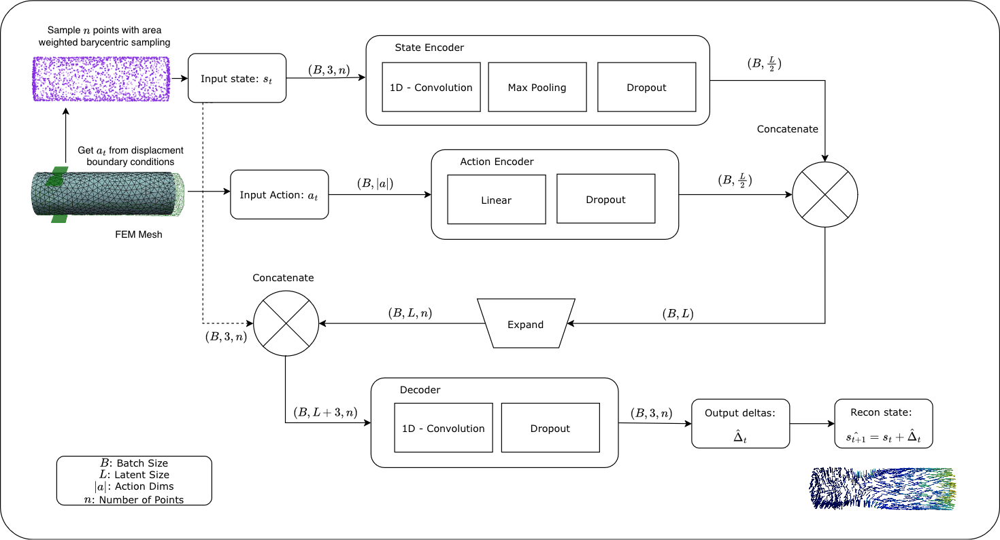
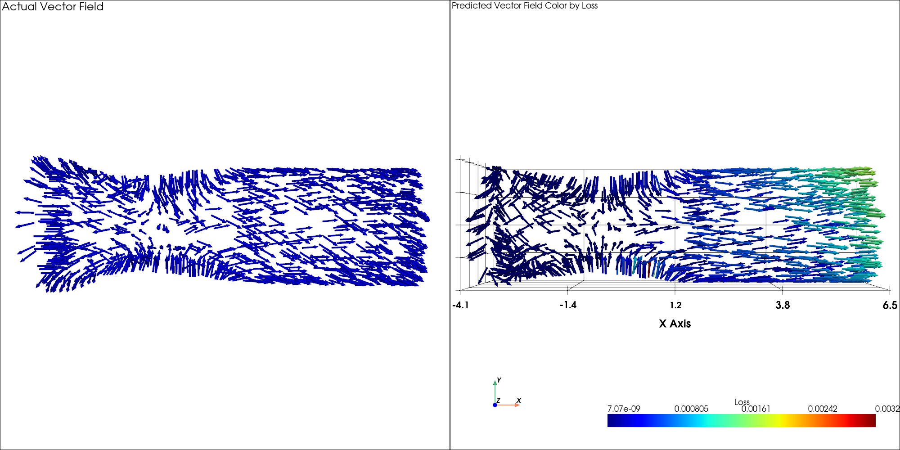
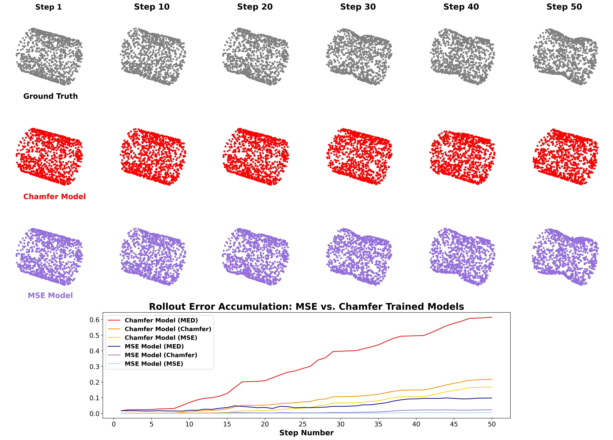

# ForgeNet

A point cloud autoencoder for predicting plastic deformation in open-die forging processes. Given a metal workpiece (point cloud) and a boundary condition (action), ForgeNet predicts the resulting per-point displacement field — enabling recursive rollout predictions of full forging sequences orders of magnitude faster than FEM.

Paper: *ForgeNet: A Point Cloud Variational Autoencoder for Predicting Plastic Deformation in Open-die Forging Processes* — Groves, Tan, Paulson, Groeber.

---

## Architecture



ForgeNet encodes a state-action pair through two separate heads:

- **State Encoder** — 1D convolutions + global max-pooling over N=2048 barycentric surface samples, producing a permutation-invariant latent vector.
- **Action Encoder** — MLP over the action features (e.g. displacement depth), producing a compatible latent vector.

The two latent vectors are concatenated, tiled to match point cardinality, and concatenated with the original XYZ coordinates before being decoded back to a per-point displacement field Δ. The reconstructed state is simply `s_{t+1} = s_t + Δ_t`.

Training uses MSE directly on the displacement field rather than Chamfer distance, which enforces point-to-point correspondence and is key to long-horizon rollout stability.

---

## Results

### One-step displacement field prediction (MSE model)



The MSE-trained model recovers physically grounded displacement vectors. The Chamfer-trained model produces a statistically similar point cloud but does not preserve the deformation field.

### Recursive rollout performance (50 steps)



The Chamfer model diverges after ~5 steps. The MSE model maintains low error across 50 recursive predictions, with the average point staying within ~0.25 units of ground truth.

---

## Installation

Requires [Conda](https://docs.conda.io/en/latest/).

```bash
git clone https://github.com/OSU-SIMCenter/forge-net
cd forge-net
conda env create -f environment.yml
conda activate forge-net
pip install -e .
```

---

## Usage

### Data

Training expects SQLite databases in `forge_net/data/databases/`. The dataset config in `forge_net/configs/training_config.yml` controls which databases are loaded and how many samples are used:

```yaml
databases:
  db1: "noisy_cogging.db"
  db2: "random_hits.db"
  lines: 20_000
```

Code to generate FEM data is available at https://github.com/OSU-SIMCenter/jax-forge
Pre-generated databases/datasets are available upon request.

### Training

Edit `forge_net/configs/training_config.yml` to set your run name, dataset, and network hyperparameters, then:

```bash
python -m forge_net.main
```

Checkpoints, loss plots, and eval outputs are saved to `forge_net/runs/<run_name>/`.

### Evaluation

To evaluate a trained run against single-step and recursive rollout metrics:

```bash
python -m forge_net.eval
```

Set `run_name` in `forge_net/eval.py` (bottom of file) to point at your saved run.

---

## Citation

```bibtex
@article{groves2026forgenet,
  title={ForgeNet: A Point Cloud Variational Autoencoder for Predicting Plastic Deformation in Open-die Forging Processes},
  author={Groves, Joshua and Tan, Tianhong and Paulson, Joel and Groeber, Michael},
  year={2026}
}
```

Supported by NSF grant EEC-2133630 (Engineering Research Center, HAMMER).
